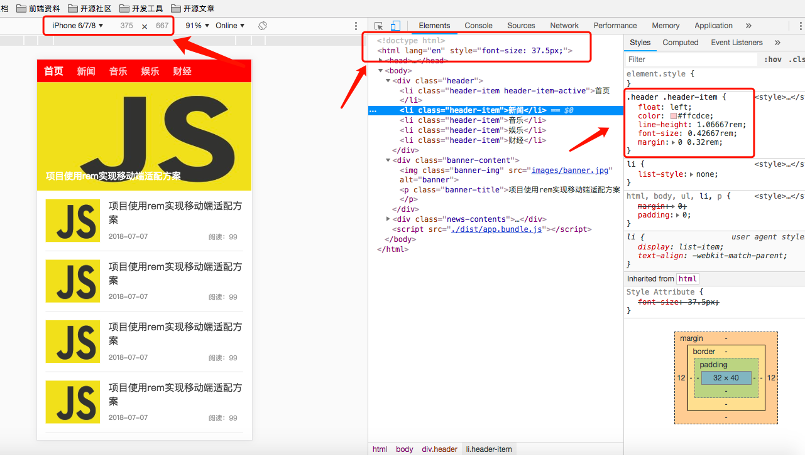

# rem-mobile-responsive-adaptation
rem移动端响应式适配


### 按照设计稿750px标准，1rem分为75px计算

```scss
@function rem ($px) {
  $rem: 75px;
  @return ($px / $rem) + rem;
}

.header {
  height: rem(80px);
  width: rem(750px);
  background-color: red;
  .header-item {
    float: left;
    color: #ffcdce;
    line-height: rem(80px);
    font-size: rem(32px);
    margin: 0 rem(30px);
    &-active {
      color: #fff;
      font-size: rem(34px);
    }
  }
}
```

### rem的适配原理是根据根元素html的font-size来计算大小的，因此监听浏览器的窗口，赋予html的font-size大小，达到适配效果。

```js
import './scss/index.scss'

const bodyDom = document.body;
const htmlDom = document.documentElement;
const htmlWidth = bodyDom.clientWidth || htmlDom.clientWidth;

htmlDom.style.fontSize = htmlWidth / 10 + 'px';

window.addEventListener('resize', (e) => {
    const htmlWidth = bodyDom.clientWidth || htmlDom.clientWidth;
    htmlDom.style.fontSize = htmlWidth / 10 + 'px';
})

```

### iPhone6示例，屏宽度为375px，那么计算html的font-size为37.5px。


